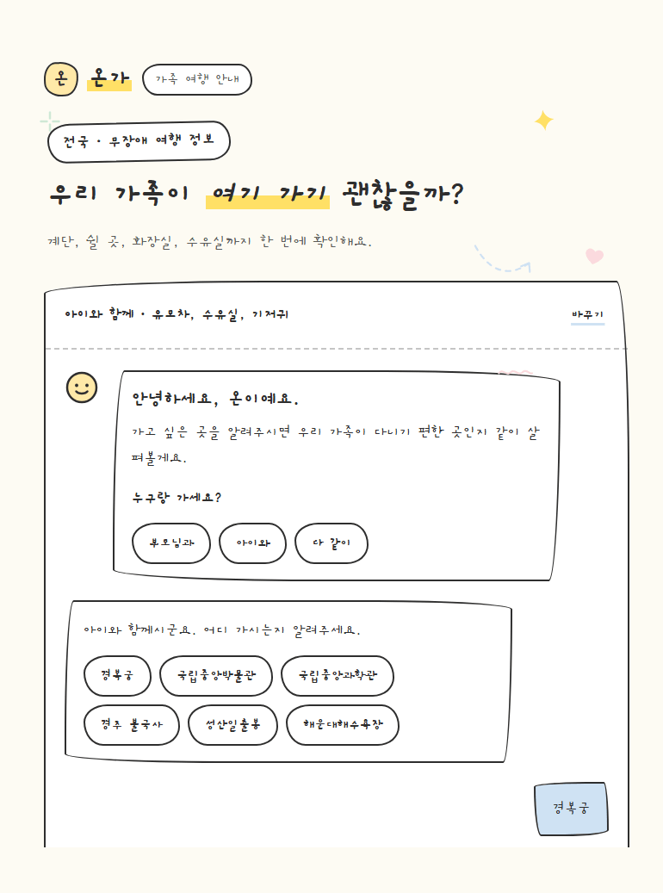

# 온가 (ON-GA) — 가족과 함께하는 편안한 여행

부모님, 영유아, 또는 온 가족이 함께 여행할 때 필요한 **이동·편의시설 정보를 공식 관광데이터 기반으로 확인하는 전국 여행 챗봇**입니다.

단순 관광지 추천보다 **“우리 가족이 이곳을 이용하기에 어떤 점을 확인해야 하는가?”**에 초점을 맞춥니다.



---

## 주요 기능

### 가족 유형별 여행 조건
사용자는 여행 동반자를 선택하고 필요한 조건을 함께 전달할 수 있습니다.

- `senior` — 부모님과 함께
- `baby` — 아이와 함께
- `both` — 온 가족 함께

현재 지원하는 주요 조건:

- 계단 이용이 어려움
- 오래 걷기 어려움
- 수유실 필요
- 기저귀 교환시설 필요
- 엘리베이터 필요
- 휠체어 필요
- 화장실 중요
- 휴식공간 필요
- 유모차 이용

### 전국 관광지 검색
한국관광공사 공식 관광정보를 기반으로 전국 관광지를 검색합니다.

- 지역이 포함된 장소 검색
- 동명이인 장소 처리
- 모호한 장소 후보 제시
- 존재하지 않는 장소 처리

예:

```text
불국사
→ 경주 불국사 / 불국사(서울) 후보 제시

해운대
→ 해운대해수욕장 / 해운대 관광특구 / 해운대 동백섬 ...
```

### 가족 편안함 판정
선택한 조건을 공식 데이터와 비교하여 구조화된 판정을 제공합니다.

내부 상태:

```text
SATISFIED
CONFLICT
UNKNOWN
```

최종 레벨:

```text
COMFORTABLE
CHECK_NEEDED
BURDEN_POSSIBLE
INSUFFICIENT_DATA
```

사용자 화면에서는 내부 enum이나 Rule Engine 용어를 직접 노출하지 않고 자연어로 표시합니다.

예:

```text
✓ 공식 정보에서 확인됐어요.
? 공식 자료에서 아직 확인되지 않았어요.
! 방문 전에 추가 확인이 필요해요.
```

### 시설 정보 + 지도 연결
관광지의 편의시설을 카드 형태로 제공합니다.

- 화장실
- 장애인 화장실
- 수유실
- 기저귀 교환시설
- 주차장
- 휠체어 대여
- 유모차 대여
- 휴식공간 등

시설마다 Backend가 생성한 `map_search_text`를 사용해 바로 지도 검색으로 연결할 수 있습니다.

지원 지도:

- 카카오맵
- 네이버지도
- 구글지도

### 후속 질문
첫 질문에서 확정된 장소의 `content_id`를 Front가 기억합니다.

```text
국립중앙박물관 알려줘
        ↓
content_id = 129703
        ↓
수유실 위치 알려줘
        ↓
같은 국립중앙박물관 기준으로 답변
```

`current_place_id`를 사용하므로 장소명을 매번 다시 입력할 필요가 없습니다.

### 모호한 장소 직접 선택
`AMBIGUOUS_PLACE` 응답에 포함된 `candidates[]`를 Front에서 바로 선택할 수 있습니다.

후보를 누르면 이름을 다시 검색하지 않고 후보의 `content_id`를 `current_place_id`로 전달합니다.

---

## UI / UX

현재 통합 버전은 `integrated-v3`입니다.

주요 UX 원칙:

- 긴 보고서형 답변 대신 **핵심 1~2문장 요약**
- `Rule Engine`, `UNKNOWN`, `SATISFIED` 등 내부 개발 용어 비노출
- 가족 조건 → 시설 → 상세 정보 순으로 정보 계층화
- 상세 이동·운영 정보와 출처는 기본적으로 접어서 표시
- 추천 질문은 기존 대화를 대체하지 않고 새 채팅 턴으로 누적
- `다른 곳 보기`, `조건 바꾸기` 제공
- 전국 대표 장소 6개 Quick Choice 제공
- 화면 전체에 Gaegu 계열 손글씨 폰트 적용
- 손그림 카드, 파스텔 배경, 시설별 픽토그램 사용

브라우저 Console에서 현재 Front 버전을 확인할 수 있습니다.

```text
[ON-GA] integrated-v3
```

---

## 시스템 구조

```text
┌──────────────────────────────┐
│          Front-End           │
│ HTML / CSS / Vanilla JS      │
│                              │
│ traveler_type / needs        │
│ current_place_id             │
└──────────────┬───────────────┘
               │ POST /chat
               ▼
┌──────────────────────────────┐
│        FastAPI Backend       │
├──────────────────────────────┤
│ 1. 장소명 추출 / 장소 식별      │
│ 2. TourAPI 공식 데이터 조회      │
│ 3. 데이터 정규화                │
│ 4. Comfort Rule Engine       │
│ 5. Facility 구조화             │
│ 6. Chroma RAG / LLM 보조       │
│ 7. 짧은 사용자용 답변 생성       │
└──────────────┬───────────────┘
               │
               ▼
┌──────────────────────────────┐
│ 한국관광공사 무장애 여행 정보      │
│ Data ID: 15101897            │
└──────────────────────────────┘
```

RAG Collection:

```text
family_travel_docs
```

---

## 기술 스택

### Front-End

- HTML5
- CSS3
- Vanilla JavaScript
- LocalStorage
- Google Fonts — Gaegu

별도 Front 빌드 도구나 패키지 설치 없이 실행합니다.

### Back-End

- Python
- FastAPI
- Pydantic
- HTTPX
- LangGraph
- LangChain
- ChromaDB
- OpenAI-compatible LLM / Embedding API
- RAGAS
- Pytest

### External Data

- 한국관광공사 무장애 여행 정보
- `KorWithService2`
- Data ID `15101897`

---

## 프로젝트 구조

```text
family_travel_integrated_v3/
├─ clients/
│  ├─ index.html
│  ├─ style.css
│  ├─ script.js
│  ├─ mock-data.mjs
│  ├─ README.md
│  └─ tests/
│     ├─ browser-qa.cjs
│     ├─ contract-check.mjs
│     └─ QA.md
│
├─ servers/
│  ├─ main.py
│  ├─ schemas.py
│  ├─ comfort.py
│  ├─ travel_data.py
│  ├─ eval_ragas.py
│  ├─ test_cases.json
│  ├─ requirements.txt
│  ├─ .env.example
│  └─ tests/
│
├─ docs/
│  └─ ...
│
├─ README.md
├─ INTEGRATION_REPORT.md
├─ UX_REFINEMENT_REPORT.md
├─ UX_REFINEMENT_V3.md
├─ V3_QA_REPORT.md
└─ .gitignore
```

---

# 실행 방법

## 1. Repository 이동

```powershell
cd C:\family_travel_integrated_v3
```

## 2. Python 가상환경 생성

```powershell
python -m venv .venv
```

PowerShell 실행 정책이 막혀 있다면 현재 터미널에만 허용합니다.

```powershell
Set-ExecutionPolicy -Scope Process -ExecutionPolicy Bypass
```

가상환경 활성화:

```powershell
.\.venv\Scripts\Activate.ps1
```

## 3. Backend 의존성 설치

```powershell
pip install -r .\servers\requirements.txt
```

## 4. 환경변수 설정

예제 파일을 복사합니다.

```powershell
Copy-Item .\servers\.env.example .\servers\.env
```

`servers/.env`에 실제 값을 입력합니다.

```env
# LLM / OpenAI-compatible provider
API_KEY=
BASE_URL=
GPT_MODEL=gpt-5-mini
EMBEDDING_MODEL_NAME=text-embedding-3-small

# 한국관광공사 무장애 여행 정보
TOUR_API_SERVICE_KEY=
TOUR_API_BASE_URL=https://apis.data.go.kr/B551011/KorWithService2

# 실제 API 사용 시 false 권장
TOUR_API_USE_MOCK_WHEN_NO_KEY=false

# LLM 없이 구조화/Rule/RAG fallback만 확인할 경우 true
DISABLE_LLM=false
```

> `.env`는 Git에 커밋하지 않습니다.

---

# Backend 실행

프로젝트 루트에서:

```powershell
cd .\servers
uvicorn main:app --reload
```

기본 주소:

```text
http://127.0.0.1:8000
```

Swagger:

```text
http://127.0.0.1:8000/docs
```

Health Check:

```text
http://127.0.0.1:8000/health
```

실제 TourAPI 연결 시:

```json
{
  "success": true,
  "tour_api_mode": "real",
  "rag_collection": "family_travel_docs"
}
```

`tour_api_mode`가 `real`인지 확인합니다.

---

# Front 실행

Backend와 별도 터미널에서 프로젝트 루트로 이동합니다.

```powershell
cd C:\family_travel_integrated_v3
python -m http.server 5500 --bind 127.0.0.1 --directory clients
```

브라우저:

```text
http://127.0.0.1:5500/
```

> `--directory clients`를 사용하므로  
> `http://127.0.0.1:5500/clients/index.html`이 아니라 `/`로 접속합니다.

---

# API Contract

## POST `/chat`

Request:

```json
{
  "message": "엄마랑 경복궁 가려고 하는데 계단이 힘들어.",
  "traveler_type": "senior",
  "needs": [
    "stairs_difficult",
    "need_rest_area",
    "restroom_important"
  ],
  "current_place_id": null
}
```

### `traveler_type`

```text
senior
baby
both
```

### `needs`

```text
stairs_difficult
walking_difficult
need_nursing_room
need_diaper_station
need_elevator
wheelchair_needed
restroom_important
need_rest_area
stroller
```

Response 주요 필드:

```json
{
  "success": true,
  "answer": "선택한 조건 중 일부는 확인됐지만 추가 확인이 필요한 정보가 있어요.",
  "place": {},
  "comfort": {},
  "sections": [],
  "facilities": [],
  "unknown_fields": [],
  "sources": [],
  "suggested_questions": [],
  "error": null,
  "candidates": []
}
```

### 주요 Error Code

```text
PLACE_NOT_FOUND
AMBIGUOUS_PLACE
TOUR_API_ERROR
RAG_ERROR
INVALID_REQUEST
NO_OFFICIAL_DATA
INTERNAL_ERROR
```

`AMBIGUOUS_PLACE`에서는 `candidates[]`가 함께 반환됩니다.

---

# 데이터 판정 원칙

이 프로젝트는 관광 편의정보를 임의로 추측하지 않는 것을 우선합니다.

### `false`
공식 자료에서 **명시적으로 없음**이 확인된 경우입니다.

### `null`
공식 자료만으로 **확인할 수 없음**을 의미합니다.

따라서:

```text
유모차 대여 가능
≠
유모차로 전체 관광지를 이동하기 편함
```

처럼 서로 다른 사실을 임의로 합치지 않습니다.

또한 장애인 전용 주차장이나 장애인 탑승차량 정보가 있다고 해서 일반 고령자가 이용할 수 있다고 가정하지 않습니다.

---

# 주요 사용자 시나리오

## 부모님과 여행

```text
엄마랑 경복궁 가려고 하는데 계단이 힘들어.
```

확인 대상:

- 계단
- 경사로
- 접근로
- 엘리베이터
- 휴식공간
- 화장실

## 영유아와 여행

```text
아이랑 국립중앙과학관 가려고 하는데 유모차 이용하기 괜찮아?
```

확인 대상:

- 유모차 접근
- 유모차 대여
- 수유실
- 기저귀 교환
- 엘리베이터

## 걷기 부담

```text
부모님이랑 성산일출봉 가려고 하는데 많이 걸어야 해?
```

공식 정보에 거리 수치가 있더라도 전체 걷기 난이도를 판단할 근거가 부족하면 `UNKNOWN`으로 유지합니다.

## 모호한 장소

```text
아이랑 해운대 가려고 해.
```

관련 관광지 후보를 제시하고 사용자가 직접 선택할 수 있습니다.

## Follow-up

```text
부모님이랑 아이랑 국립중앙박물관 가려고 해.
```

이후:

```text
수유실 위치 알려줘.
```

기존 장소의 `current_place_id`를 유지해 같은 관광지 기준으로 답변합니다.

---

# 테스트

## Backend

```powershell
cd .\servers
python -m pytest -q
```

현재 통합 v3 기준:

```text
51 passed
```

## Front ↔ Backend Contract

Backend를 실행한 상태에서 프로젝트 루트에서:

```powershell
node .\clients\tests\contract-check.mjs
```

현재 기준:

```text
필수 위반 0건
권고 0건
```

## JavaScript Syntax Check

```powershell
node --check .\clients\script.js
node --check .\clients\mock-data.mjs
node --check .\clients\tests\browser-qa.cjs
node --check .\clients\tests\contract-check.mjs
```

---

# Mock Front 확인

Front의 Mock fixture를 이용해 UI만 빠르게 확인할 수도 있습니다.

예:

```text
http://127.0.0.1:5500/?mock=baby
```

주요 Mock:

```text
senior
baby
both
many
burden
insufficient
not_found
ambiguous
network
http_error
slow
timeout
auto
```

> Mock은 UI 테스트용 예시이며 실제 관광정보가 아닙니다.

---

# 사용자 화면에 노출하지 않는 내부 표현

성공 화면에서는 아래와 같은 개발용 표현을 직접 보여주지 않습니다.

```text
Rule Engine
Comfort 판정
SATISFIED
CONFLICT
UNKNOWN
CHECK_NEEDED
BURDEN_POSSIBLE
INSUFFICIENT_DATA
need_*
stairs_difficult
walking_difficult
```

Front는 내부 구조화 데이터를 자연어 카드로 변환해 보여줍니다.

---

# 개발용 Endpoint

일반 Front에서 사용하는 핵심 Endpoint는 `/chat`입니다.

개발/검증용으로 다음 Endpoint도 존재합니다.

```text
GET  /health
POST /simpleparam
POST /upload
POST /reset-db
```

`/upload`, `/reset-db`는 사용자 UI에 노출하지 않는 개발용 기능입니다.

---

# Git 관리

`.gitignore`에 다음 항목이 포함되어 있습니다.

```text
.env
.venv/
__pycache__/
*.pyc
.pytest_cache/
servers/data/cache/
servers/chroma_data/
manual_eval_results.csv
ragas_eval_results.csv
ragas_eval_history.md
```

API Key와 로컬 DB/Cache는 Repository에 업로드하지 않습니다.

---

# 현재 상태

`family_travel_integrated_v3`

- Front + Backend 통합 완료
- 실제 TourAPI 연동 완료
- 전국 장소 검색 완료
- 모호 장소 후보 선택 완료
- 가족 조건 Comfort Engine 적용
- Facility / 지도 검색 연결 완료
- Follow-up `current_place_id` 적용
- Mock / Real cache 분리
- 사용자용 답변 1~2문장 축약
- 내부 Rule Engine 용어 비노출
- Gaegu 기반 UI 통일
- Backend Test **51 passed**
- Shared Contract **필수 위반 0 / 권고 0**

---

## 관련 문서

세부 구현·통합·QA 기록은 다음 파일을 참고하세요.

- `INTEGRATION_REPORT.md`
- `UX_REFINEMENT_REPORT.md`
- `UX_REFINEMENT_V3.md`
- `V3_QA_REPORT.md`
- `docs/통합_인수인계.md`

